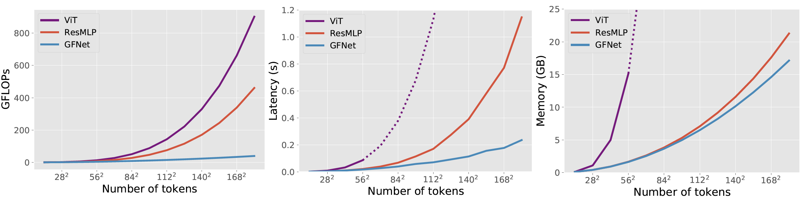
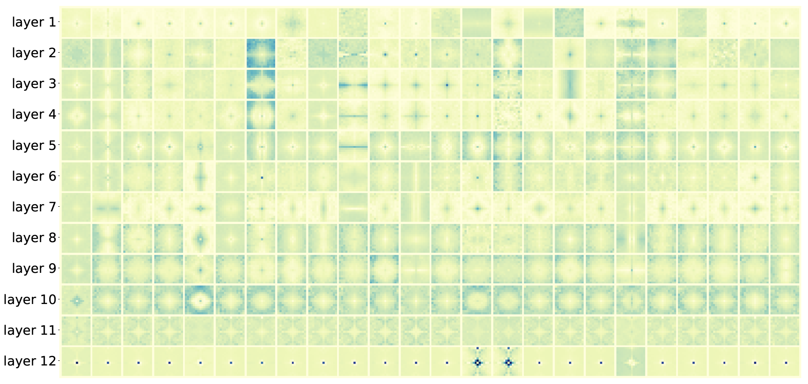

# Global Filter Networks for Image Classification

Created by [Yongming Rao](https://raoyongming.github.io/), [Wenliang Zhao](https://wl-zhao.github.io/), [Zheng Zhu](http://www.zhengzhu.net/), [Jiwen Lu](https://scholar.google.com/citations?user=TN8uDQoAAAAJ&hl=en&authuser=1), [Jie Zhou](https://scholar.google.com/citations?user=6a79aPwAAAAJ&hl=en&authuser=1)

This repository contains PyTorch implementation for GFNet (NeurIPS 2021 & T-PAMI).

Global Filter Networks is a transformer-style architecture that learns long-term spatial dependencies in the frequency domain with log-linear complexity. Our architecture replaces the self-attention layer in vision transformers with three key operations: a 2D discrete Fourier transform, an element-wise multiplication between frequency-domain features and learnable global filters, and a 2D inverse Fourier transform.


Our code is based on [pytorch-image-models](https://github.com/rwightman/pytorch-image-models) and [DeiT](https://github.com/facebookresearch/deit).

[[Project Page]](https://gfnet.ivg-research.xyz/) [[arXiv]](https://arxiv.org/abs/2107.00645)

## Global Filter Layer

GFNet is a conceptually simple yet computationally efficient architecture, which consists of several stacking Global Filter Layers and Feedforward Networks (FFN).  The Global Filter Layer mixes tokens with log-linear complexity benefiting from the highly efficient Fast Fourier Transform (FFT) algorithm.  The layer is easy to implement: 

```python
import torch
import torch.nn as nn
import torch.fft

class GlobalFilter(nn.Module):
    def __init__(self, dim, h=14, w=8):
        super().__init__()
        self.complex_weight = nn.Parameter(torch.randn(h, w, dim, 2, dtype=torch.float32) * 0.02)

    def forward(self, x):
        B, H, W, C = x.shape
        x = torch.fft.rfft2(x, dim=(1, 2), norm='ortho')
        weight = torch.view_as_complex(self.complex_weight)
        x = x * weight
        x = torch.fft.irfft2(x, s=(H, W), dim=(1, 2), norm='ortho')
        return x

```

Compared to self-attention and spatial MLP, our Global Filter Layer is much more efficient to process high-resolution feature maps:



## Model Zoo

We provide our GFNet models pretrained on ImageNet:
| name | arch | Params | FLOPs | acc@1 | acc@5 | url |
| --- | --- | --- | --- | --- | --- | --- |
| GFNet-Ti | ```gfnet-ti``` | 7M | 1.3G | 74.6 | 92.2 |  [Tsinghua Cloud](https://cloud.tsinghua.edu.cn/f/3d0c1579aa524a0a99dd/?dl=1) / [Google Drive](https://drive.google.com/file/d/1_xrfC7c_ccZnVicYDnrViOA_T1N-xoHI/view?usp=sharing)|
| GFNet-XS | ```gfnet-xs``` | 16M | 2.8G | 78.6 | 94.2 | [Tsinghua Cloud](https://cloud.tsinghua.edu.cn/f/e0ab5b1583954a1fa9b2/?dl=1) / [Google Drive](https://drive.google.com/file/d/1paf9gQWdsLXrG58R77yJ3U0FiNINg9xN/view?usp=sharing)|
| GFNet-S | ```gfnet-s``` | 25M | 4.5G | 80.0 | 94.9 | [Tsinghua Cloud](https://cloud.tsinghua.edu.cn/f/e5561fa070c44d9399bf/?dl=1) / [Google Drive](https://drive.google.com/file/d/18aRey_1abWNMmSL7TZQ4WxpplLRCDGEl/view?usp=sharing)|
| GFNet-B | ```gfnet-b``` | 43M | 7.9G | 80.7 | 95.1 | [Tsinghua Cloud](https://cloud.tsinghua.edu.cn/f/2fbf264597af4d72afb3/?dl=1) / [Google Drive](https://drive.google.com/file/d/1OncnXYAXpdjZBq4JK5Y3xacIHOIMePQo/view?usp=sharing)|
| GFNet-H-Ti | ```gfnet-h-ti``` | 15M | 2.0G | 80.1 | 95.1 | [Tsinghua Cloud](https://cloud.tsinghua.edu.cn/f/b22dd45eccbe462cbbfb/?dl=1) / [Google Drive](https://drive.google.com/file/d/1Nrq5sfHD9RklCMl6WkcVrAWI5vSVzwSm/view?usp=sharing)|
| GFNet-H-S | ```gfnet-h-s``` | 32M | 4.5G | 81.5 | 95.6 | [Tsinghua Cloud](https://cloud.tsinghua.edu.cn/f/5229cb4d1daf48e69675/?dl=1) / [Google Drive](https://drive.google.com/file/d/1w4d7o1LTBjmSkb5NKzgXBBiwdBOlwiie/view?usp=sharing)|
| GFNet-H-B | ```gfnet-h-b``` | 54M | 8.4G | 82.9 | 96.2 | [Tsinghua Cloud](https://cloud.tsinghua.edu.cn/f/954c5af21e824ba6b40c/?dl=1) / [Google Drive](https://drive.google.com/file/d/1F900_-yPH7GFYfTt60xn4tu5a926DYL0/view?usp=sharing)|


## Usage

### Requirements

- torch>=1.8.0
- torchvision
- timm

*Note*: To use the ```rfft2``` and ```irfft2``` functions in PyTorch, you need to install PyTorch>=1.8.0. Complex numbers are supported after PyTorch 1.6.0, but the ```fft``` API is slightly different from the current version. 

**Data preparation**: download and extract ImageNet images from http://image-net.org/. The directory structure should be

```
│ILSVRC2012/
├──train/
│  ├── n01440764
│  │   ├── n01440764_10026.JPEG
│  │   ├── n01440764_10027.JPEG
│  │   ├── ......
│  ├── ......
├──val/
│  ├── n01440764
│  │   ├── ILSVRC2012_val_00000293.JPEG
│  │   ├── ILSVRC2012_val_00002138.JPEG
│  │   ├── ......
│  ├── ......
```

### Evaluation

To evaluate a pre-trained GFNet model on the ImageNet validation set with a single GPU, run:

```
python infer.py --data-path /path/to/ILSVRC2012/ --arch arch_name --model-path /path/to/model
```


### Training

#### ImageNet

To train GFNet models on ImageNet from scratch, run:

```
python -m torch.distributed.launch --nproc_per_node=8 --use_env main_gfnet.py  --output_dir logs/gfnet-xs --arch gfnet-xs --batch-size 128 --data-path /path/to/ILSVRC2012/
```

To finetune a pre-trained model at higher resolution, run:

```
python -m torch.distributed.launch --nproc_per_node=8 --use_env main_gfnet.py  --output_dir logs/gfnet-xs-img384 --arch gfnet-xs --input-size 384 --batch-size 64 --data-path /path/to/ILSVRC2012/ --lr 5e-6 --weight-decay 1e-8 --min-lr 5e-6 --epochs 30 --finetune /path/to/model
```

#### Transfer Learning Datasets

To finetune a pre-trained model on a transfer learning dataset, run:
```
python -m torch.distributed.launch --nproc_per_node=8 --use_env main_gfnet_transfer.py  --output_dir logs/gfnet-xs-cars --arch gfnet-xs --batch-size 64 --data-set CARS --data-path /path/to/stanford_cars --epochs 1000 --lr 0.0001 --weight-decay 1e-4 --clip-grad 1 --warmup-epochs 5 --finetune /path/to/model 
```

## Visualization

To have an intuitive understanding of our Global Filter operation, we visualize the learned filters from different layers of GFNet-XS. 



## License
MIT License

## Citation
If you find our work useful in your research, please consider citing:
```
@inproceedings{rao2021global,
  title={Global Filter Networks for Image Classification},
  author={Rao, Yongming and Zhao, Wenliang and Zhu, Zheng and Lu, Jiwen and Zhou, Jie},
  booktitle = {Advances in Neural Information Processing Systems (NeurIPS)},
  year = {2021}
}
```
